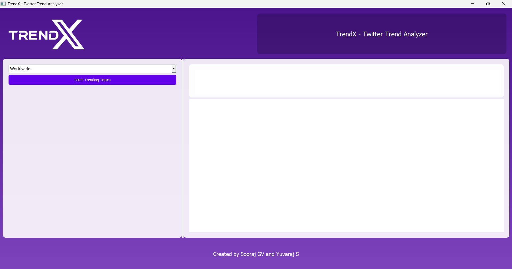

# TrendX - Twitter Trend Analyzer


TrendX is a Twitter trend analyzer application built using PyQt5 and Python. It fetches and displays trending topics from trends24.in, visualizes data using charts (Pie Chart, Word Cloud, etc.), and provides an interactive user interface.

## Features

- Fetches trending topics from worldwide or India based on user selection.
- Displays trending topics in a QTextEdit widget.
- Visualizes trending topics using various chart types:
  - Word Cloud
  - Pie Chart (to be implemented)
  - Bar Chart (to be implemented)
  - Scatter Plot (to be implemented)
  - Time Series (to be implemented)

## Screenshots




## Installation

### Requirements

- Python 3.xx
- PyQt5
- Requests
- BeautifulSoup4
- Matplotlib
- Wordcloud

### Installation Steps

1. Clone the repository:
   ```bash
   git clone https://github.com/yuva-raj-s/TrendX.git
   cd repository

2. Install dependencies:
    ```bash
   pip freeze > requirements.txt
   pip install -r requirements.txt

3. Run the application:
   ```bash
   python trend_analyzer_gui.py


## Usage

1. **Select the location**: Choose between 'Worldwide' or 'India' from the dropdown menu.
2. **Fetch Trending Topics**: Click on the "Fetch Trending Topics" button to fetch and display the latest trending topics.
3. **Explore Visualizations**: Use the buttons on the right panel to explore different visualization options such as Pie Chart, Word Cloud, and more.


### Contributors

- [Sooraj-G-V](https://github.com/SoorajVaidya)

## Acknowledgements

- Thanks to [Trends24](https://trends24.in) for providing trending topics data.
